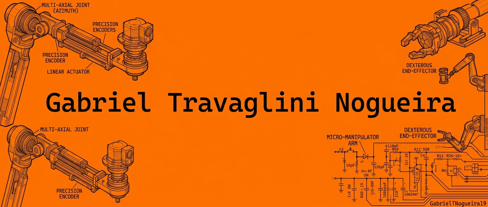

  

<h1 align="center">
  
</h1>

  
  
  
  

  
  

  

---

## 🧠 Sobre mim

Sou estudante de Desenvolvimento de Sistemas no SENAI/Limeira, membro da equipe de robótica Laranja Mecânica e aluno do SESI 408/Limeira. Tenho interesse em tecnologia, inovação e resolução de problemas por meio da programação, com foco principal em Python, C++ e C#. Busco aprender constantemente, criar soluções úteis e evoluir com disciplina, curiosidade e criatividade.

---

## 🧩 Dashboard técnico

<table>
  <tr>
    <td width="33%" valign="top" bgcolor="#111111" style="border: 2px solid #F97316; border-radius: 12px; padding: 16px; color: #F9FAFB;">
      <strong>📁 Arquivos</strong>  
      <code style="color: #F97316; font-size: 24px;">120+</code> 
      arquivos e estudos organizados
    </td>
    <td width="33%" valign="top" bgcolor="#111111" style="border: 2px solid #F97316; border-radius: 12px; padding: 16px; color: #F9FAFB;">
      <strong>🧠 Aprendizado</strong>  
      <code style="color: #F97316; font-size: 24px;">20+</code> 
      tecnologias e conceitos em estudo
    </td>
    <td width="33%" valign="top" bgcolor="#111111" style="border: 2px solid #F97316; border-radius: 12px; padding: 16px; color: #F9FAFB;">
      <strong>⚙️ Projetos</strong>  
      <code style="color: #F97316; font-size: 24px;">08</code> 
      ideias e protótipos em desenvolvimento
    </td>
  </tr>
  <tr>
    <td width="33%" valign="top" bgcolor="#111111" style="border: 2px solid #F97316; border-radius: 12px; padding: 16px; color: #F9FAFB;">
      <strong>🤖 Robótica</strong>  
      <code style="color: #F97316; font-size: 24px;">04</code> 
      linhas de estudo e experimentação
    </td>
    <td width="33%" valign="top" bgcolor="#111111" style="border: 2px solid #F97316; border-radius: 12px; padding: 16px; color: #F9FAFB;">
      <strong>💻 Códigos</strong>  
      <code style="color: #F97316; font-size: 24px;">50+</code> 
      scripts, testes e práticas em Python/C++
    </td>
    <td width="33%" valign="top" bgcolor="#111111" style="border: 2px solid #F97316; border-radius: 12px; padding: 16px; color: #F9FAFB;">
      <strong>📚 Evolução</strong>  
      <code style="color: #F97316; font-size: 24px;">100%</code> 
      foco em crescimento constante
    </td>
  </tr>
</table>

---

## 🛠️ Stack principal

  
  
  
  
  
  
  
  

---

## 🧠 Aprendizado em andamento

<table>
  <tr>
    <td bgcolor="#111111" style="border: 2px solid #F97316; border-radius: 12px; padding: 12px; color: #F9FAFB;">
      <strong>🧪 Lógica aplicada</strong> 
      Treinando raciocínio, algoritmos e estrutura de resolução de problemas.
    </td>
    <td bgcolor="#111111" style="border: 2px solid #F97316; border-radius: 12px; padding: 12px; color: #F9FAFB;">
      <strong>🤖 Robótica</strong> 
      Estudo de sensores, automação, lógica de controle e prototipagem.
    </td>
  </tr>
  <tr>
    <td bgcolor="#111111" style="border: 2px solid #F97316; border-radius: 12px; padding: 12px; color: #F9FAFB;">
      <strong>🧬 Sistemas</strong> 
      Entendimento sobre desenvolvimento, organização e funcionalidade de software.
    </td>
    <td bgcolor="#111111" style="border: 2px solid #F97316; border-radius: 12px; padding: 12px; color: #F9FAFB;">
      <strong>📐 Criatividade técnica</strong> 
      Transformando ideias em soluções práticas, úteis e inovadoras.
    </td>
  </tr>
</table>

---

##  Áreas de interesse

- Desenvolvimento de sistemas e automação
- Robótica e prototipagem
- Programação lógica e algoritmos
- Inovação tecnológica e resolução de problemas
- Aprendizado contínuo e projetos criativos

---

## 🧩 Destaques

  
  
  

---

## 📌 Formação e trajetória

- Estudante de Desenvolvimento de Sistemas no SENAI/Limeira
- Membro da equipe de robótica Laranja Mecânica
- Aluno do SESI 408/Limeira
- Interessado em aprender, criar e evoluir com tecnologia

---

## 🌐 Conecte-se comigo

  
  
  

  

> “Tecnologia, criatividade e futuro em movimento.”

---

## 📈 Estatísticas do GitHub

  

  

---

## ✅ Checklist pessoal

- [x] Estudante de Desenvolvimento de Sistemas
- [x] Interesse em programação e robótica
- [x] Foco em Python, C++ e C#
- [x] Participação em equipe de robótica
- [x] Estudo contínuo e aprendizagem prática
- [x] Busca por inovação e solução de problemas
- [x] Projeto de crescimento pessoal e profissional
- [x] Compromisso com evolução constante
- [x] Ambição por tecnologia aplicada
- [x] Vontade de criar projetos relevantes

---

## 💬 Mensagem final

A tecnologia me inspira por sua capacidade de transformar conhecimento em ação. Cada código escrito, cada projeto desenvolvido e cada desafio enfrentado são parte do meu crescimento. Estou em constante evolução, buscando aprender mais, criar melhores soluções e me tornar uma pessoa mais preparada para construir um futuro tecnológico forte e inovador.

> “Tecnologia, criatividade, dedicação e futuro em movimento.”

